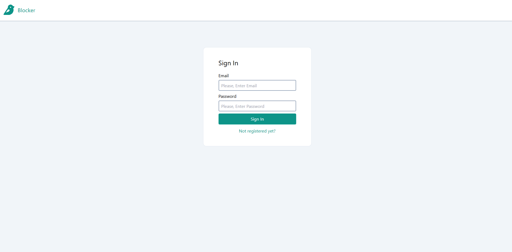
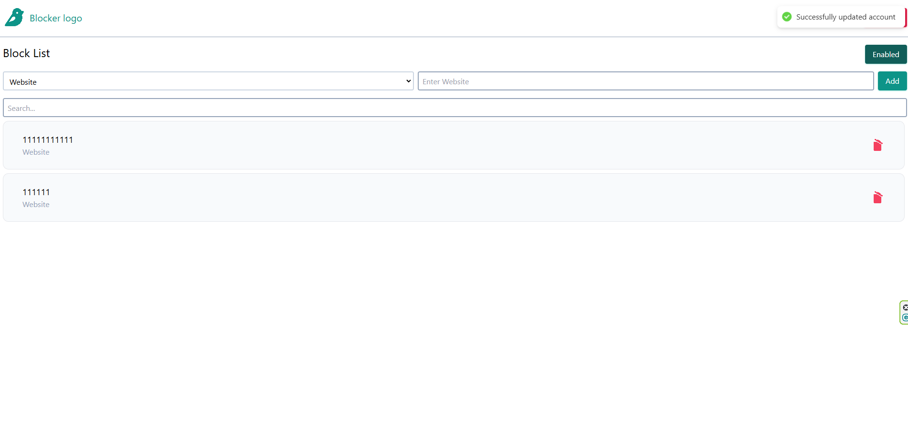

## 🎨 Пользовательский интерфейс
 
 

**Blocker App** — это современное веб-приложение для управления списком заблокированных ресурсов. Разработано с использованием **Feature-Sliced Design (FSD)** для обеспечения масштабируемости, читаемости и удобства поддержки кода.  

## 📌 Функциональные возможности  
- **Добавление в блок-лист**: Легко добавляйте нежелательные ресурсы в список.  
- **Удаление из блок-листа**: Удаляйте ресурсы из списка по одному клику.  
- **Фильтрация списка**: Реализован поиск с использованием debounce для удобного и быстрого нахождения нужных записей.  
- **Интеграция с профилем пользователя**: Поддержка отображения данных текущего пользователя.  
- **Реализация UI компонентов**: Использование типографики, кнопок, форм и других элементов интерфейса.  

## 🛠️ Используемый стек технологий  
- **React** — построение пользовательского интерфейса.  
- **React Query** — управление состоянием данных и кэширование запросов.  
- **TypeScript** — строгая типизация для повышения надежности кода.  
- **Tailwind CSS** — стилизация интерфейса.  
- **React Hot Toast** — уведомления для пользователей.  
- **Storybook** — визуальная документация компонентов UI.  

## 📂 Архитектура  
Проект построен с использованием архитектуры **Feature-Sliced Design (FSD)**, что обеспечивает:  
- Разделение логики и UI.  
- Удобство добавления новых функций.  
- Легкость сопровождения и масштабирования.  

